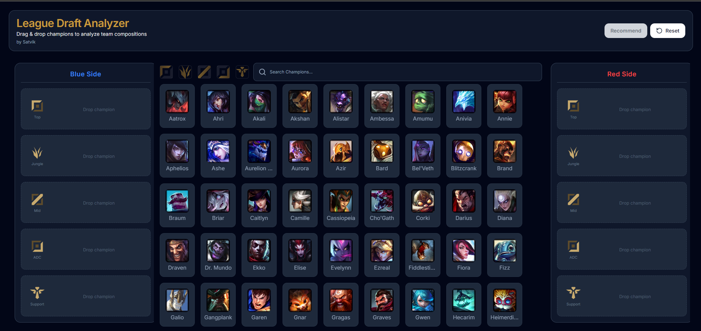
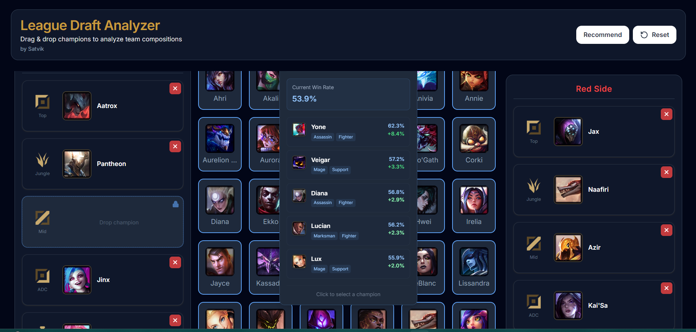
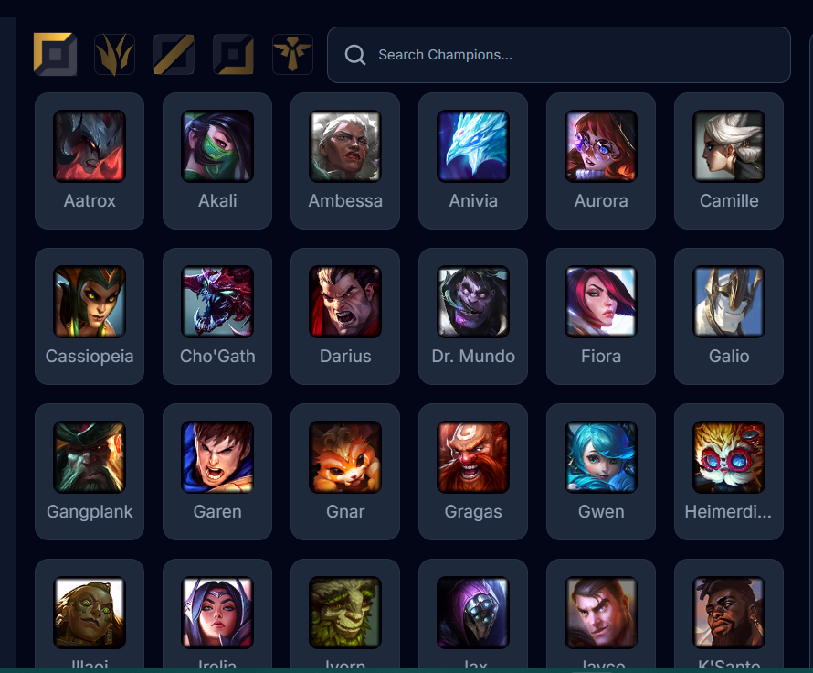

# League Draft Analyzer — Frontend

Interactive drafting interface for building League of Legends team compositions and receiving machine learning powered champion recommendations.

The frontend provides a real-time drafting experience similar to the in-game League Client draft phase.

---

## Live Demo

Frontend Deployment:

https://your-vercel-link.vercel.app

Backend powered by FastAPI ML inference API hosted on AWS EC2.

---

## Features

* Champion search and filtering.
* Role based champion filters.
* Drag and drop drafting system.
* Locked role recommendation workflow.
* Real-time win probability prediction.
* Recommendation overlay panel.

---

## Tech Stack

React
TailwindCSS
dnd-kit Drag and Drop
Vercel Deployment

Data Source:

Riot Data Dragon champion assets.

---

## Screenshots

### Draft Interface

### Recommendation Panel

### Role Filtering

---

## Design

Figma Design:

https://www.figma.com/design/MCy5Zit89Oz0Io6nHtJ6xN/League-Project

---

## Architecture

React Frontend

↓

FastAPI Backend API

↓

XGBoost ML Model.

---

## Development Setup

Clone repository:

git clone https://github.com/yourusername/lol-draft-analyzer-frontend

Install dependencies:

npm install

Run development server:

npm run dev

---

## Author

Satvik Singh Rathore
